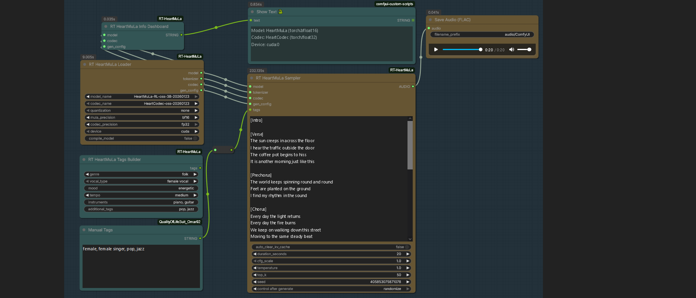
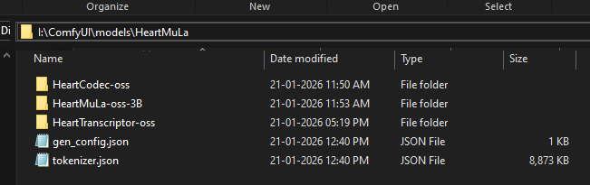

# $${\color{white}ComfyUI-}{\color{orange}R}{\color{yellow}T}{\color{white}-HeartMuLa}$$

A custom node suite for ComfyUI.


---
### Recommended Loader Settings

| GPU Tier | Target Use Case | Quantization | Precision (Mula / Codec) | Compile? | Explanation |
| :--- | :--- | :--- | :--- | :--- | :--- |
| **High-End**<br>*(24GB+ VRAM)*<br>RTX 3090 / 4090 | **Highest Quality** | `none` | `bf16` / `fp32` | `True` | `none` quantization loads full weights for max fidelity. `fp32` codec ensures zero high-frequency hiss. `Compile` speeds up batch runs. |
| **Mid-Range**<br>*(12-16GB VRAM)*<br>RTX 3060 / 4070 | **Balanced** | `4bit` | `bf16` / `bf16` | `False` | `4bit` saves ~50% VRAM, allowing longer song context. `bf16` is faster on modern cards (Ampere/Ada). |
| **Low-End**<br>*(8GB VRAM)*<br>RTX 2060 / 3050 | **High Speed** | `4bit` | `fp16` / `fp16` | `False` | `fp16` is universally supported and lighter. Quantization is mandatory here to prevent Out-Of-Memory (OOM) errors. |

---

### Key Settings Explained

* **`quantization`**:
    * **`none`**: Best quality but requires ~16GB+ dedicated VRAM.
    * **`4bit` (Recommended)**: Virtually indistinguishable audio quality for most users. Reduces model size significantly, allowing for longer generation durations on standard cards.
* **`codec_precision`**:
    * **`fp32`**: Critical for studio-quality "High Fidelity" output. It prevents metallic artifacts in high frequencies (cymbals, "s" sounds) but is slower.
    * **`bf16` / `auto`**: Good for speed and lower memory usage.
* **`compile_model`**:
    * **`True`**: Adds a 1-2 minute delay on the *first* generation to optimize the graph. Makes subsequent generations 20-30% faster. Ideal for batch production.
    * **`False`**: Instant start. Best for testing single prompts.
---
## Installation

Follow these steps to get **ComfyUI-RT-HeartMuLa** up and running.

### $${\color{yellow}Step \ 1: \ Clone \ the \ Repository}$$
Open your terminal or command prompt, navigate to your `ComfyUI\custom_nodes` folder, and run:

```bash
git clone https://github.com/monnky/ComfyUI-RT-HeartMuLa

```
### $${\color{yellow}Step \ 2: \ Navigate \ to \ the \ Directory}$$
Change into the project folder:

```bash
cd ComfyUI-RT-HeartMuLa
```


### $${\color{yellow}Step \ 3: \ Install \ Dependencies}$$

First Try install only 3 dep's
```bash
pip install soundfile
pip install torchtune
pip install torchao
```

(if doesnt work, install all requirements)
Install the required Python packages:

```bash
pip install -r requirements.txt
```


### $${\color{yellow}Step \ 4: \ Download \ Model \ Files}$$

Navigate to your `ComfyUI/models` directory and use the Hugging Face CLI to download the required weights.

> [!TIP]
> Ensure you have the [git-lfs-windows.exe](https://git-lfs.com/) installed.
> Run the Installer: Double-click the downloaded git-lfs-windows.exe file and follow the setup wizard prompts.

```bash
# Go to ComfyUI/models folder and open CMD

# Initialize LFS: Open Git Bash (or your preferred terminal) and run:
git lfs install

# 1. Clone the main Generation repo
git clone https://huggingface.co/HeartMuLa/HeartMuLaGen HeartMuLa

# 2. Navigate into the directory to clone the components
cd HeartMuLa

# 3. Clone the specific model components into subdirectories
git clone https://huggingface.co/HeartMuLa/HeartMuLa-oss-3B
git clone https://huggingface.co/HeartMuLa/HeartCodec-oss
git clone https://huggingface.co/HeartMuLa/HeartTranscriptor-oss
```
___

Model File Structure
Once downloaded, your folder should look like this:


___

### $${\color{yellow}Model \ Sources}$$

Explore the technical foundations and official repositories for the models used in this project:

* **GitHub Repository:** [HeartMuLa/heartlib](https://github.com/HeartMuLa/heartlib)
* **Technical Paper:** [ArXiv: 2601.10547](https://arxiv.org/abs/2601.10547)
* **Official Demo:** [HeartMuLa Project Page](https://heartmula.github.io/)

#### **Hugging Face Model Hub:**
* **HeartMuLaGen Config Files:** [HeartMuLaGen](https://huggingface.co/HeartMuLa/HeartMuLaGen/tree/main)
* **Main Model (3B):** [HeartMuLa-oss-3B](https://huggingface.co/HeartMuLa/HeartMuLa-oss-3B)
* **Codec:** [HeartCodec-oss](https://huggingface.co/HeartMuLa/HeartCodec-oss)
* **Transcriptor:** [HeartTranscriptor-oss](https://huggingface.co/HeartMuLa/HeartTranscriptor-oss)

---

### $${\color{yellow}Credits}$$

Special thanks to the **HeartMuLa** team for providing the open-source weights and research that make these nodes possible.

* **HeartMuLa Organization:** [Hugging Face Profile](https://huggingface.co/HeartMuLa)

---
# Changelog

## [1.06]
### Fixed
- **CFG Scale Crash**: Fixed a critical "Batch Size Mismatch" error when switching between CFG 1.0 and higher values. Implemented a hard KV-Cache reset to synchronize batch dimensions.
- **Decoder Hang**: Fixed an issue where the `fp32` codec would hang indefinitely when used with quantized models. Added explicit device casting and eval mode synchronization.
- **Linting Errors**: Resolved formatting issues in the generation logic for better code stability.

### Optimized
- **Long-Form Audio**: Improved audio clarity for 4-minute tracks by implementing **Temperature Decay** and aggressive VRAM cache cleanup to prevent robotic artifacts.
- **Tag Compliance**: Updated conditioning nodes to strictly enforce lowercase and comma-separated tag formatting as required by the paper.

## [1.1]
### Added
- Split codec support (Dual Precision for Model/Decoder)

## [1.0]
### Initial Release
- First public release


